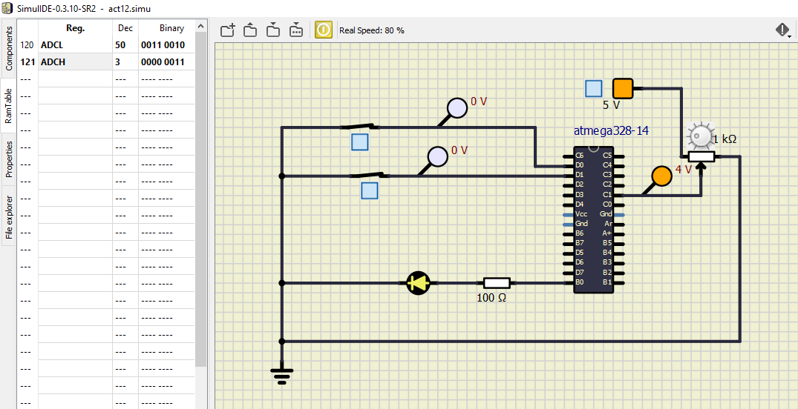
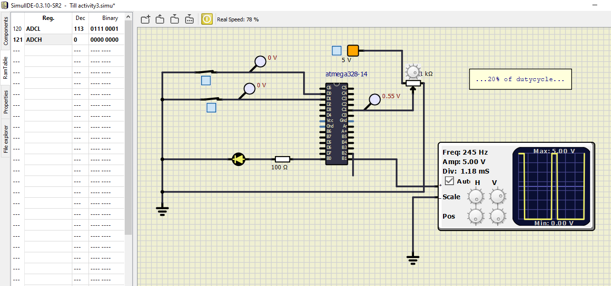
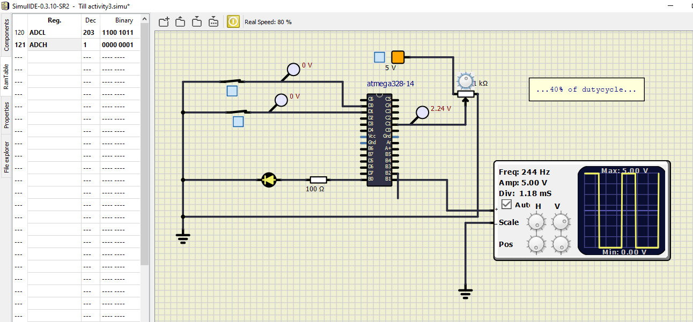
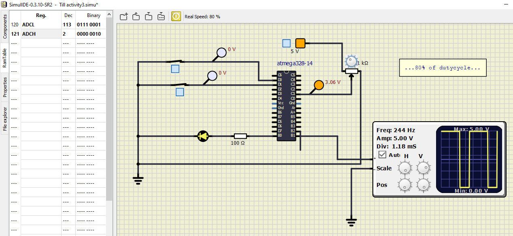
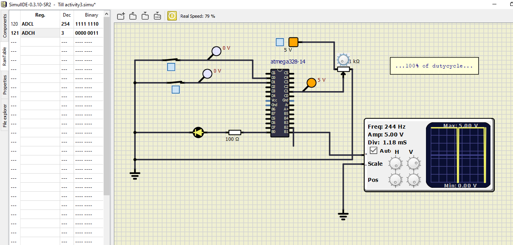
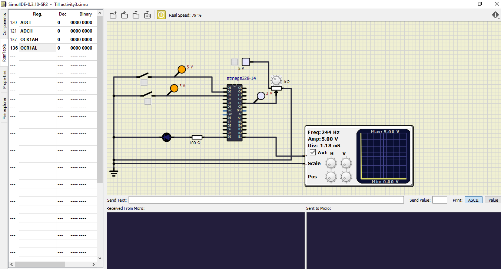

# Embedded_AVR_project

## Activity1

|ON|OFF|     
|----|-----| 
|||

## Activity2

## Activity3 

### 20% of dutycycle

### 40% of dutycycle

### 80% of dutycycle

### 100% of dutycycle

## SeatHeaterApplication

### Activity 4

### ON condition

### OFF condition

## In Action

|Build|CppCheck|Codacy| 
|---------|------|------|
||| |
